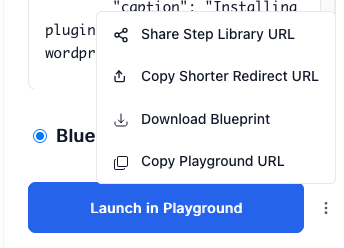

# Tips & Tricks

Power user tips for getting the most out of the WordPress Playground Step Library.

## Quick Navigation

### 🎯 Smart Features
- [**Smart Paste Handlers**](#smart-paste-handlers) - Auto-detect PHP, HTML, CSS, JavaScript, and URLs to create steps
  - [Paste PHP Code](#paste-php-code) - Auto-creates muPlugin or runPHP steps
  - [Paste HTML](#paste-html-content) - Auto-creates addPost steps with title extraction
  - [Paste CSS](#paste-css) - Auto-creates enqueueCSS steps
  - [Paste JavaScript](#paste-javascript) - Auto-creates enqueueJS steps
  - [Paste URLs](#paste-urls) - Auto-creates install plugins/themes steps from WordPress.org or GitHub
  - [Paste Multiple URLs](#paste-multiple-urls) - Add multiple steps to install plugins
  - [Paste wp-admin URLs](#paste-wp-admin-urls) - Sets the landing page
  - [Paste Playground URLs](#paste-playground-urls) - Add multiple steps from a Playground URL
  - [Paste Blueprint JSON](#paste-blueprint-json) - Add multiple steps from a blueprint JSON

### ⌨️ Productivity
- [**Keyboard Shortcuts**](#keyboard-shortcuts) - Speed up your workflow
- [**URL Patterns**](#url-patterns) - Share and customize blueprints via URL

### 🎨 UI Features
- [**UI Component Tips**](#ui-component-tips) - Master the interface
  - [Blueprint Settings](#blueprint-settings) - Configure WordPress/PHP versions, storage, display mode
  - [My Blueprints](#my-blueprints) - Save, search, export, and manage blueprints
  - [Copy Dropdown](#copy-dropdown-three-dots-menu) - 5 ways to share your blueprint
- [**Live Preview Mode**](#live-preview-mode) - See changes in real-time
- [**Wizard Mode**](#wizard-mode) - Simplified step-by-step interface
- [**Examples Library**](#examples-library) - Pre-built blueprints to start from

### 🛠️ Working with Steps
- [**Step Management**](#working-with-steps) - Reorder, duplicate, remove steps
- [**Advanced Tricks**](#advanced-tricks) - Variable substitution, deduplication control

### 📚 Workflows & Recipes
- [**Common Workflows**](#common-workflows) - Quick recipes for common tasks
- [**Hidden Features**](#hidden-features) - Lesser-known tips
- [**Best Practices**](#best-practices) - Guidelines for sharing and development

### 🔧 Help
- [**Troubleshooting**](#troubleshooting) - Fix common issues
- [**Getting Help**](#getting-help) - Documentation and support

---

## Smart Paste Handlers

The Step Library has **intelligent paste detection** that automatically creates steps from pasted content.

### Paste PHP Code

Just copy PHP code and paste anywhere in the Step Library UI. It will automatically:

1. **Detect if it's a plugin** (has hooks like `add_action`, `add_filter`)
2. **Create an `muPlugin` step** for plugins
3. **Create a `runPHP` step** for simple scripts
4. **Auto-name it** as "pasted-plugin" (you can rename it)

**Example:**
```php
add_action('wp_footer', function() {
    echo '<p>Hello from my plugin!</p>';
});
```

Paste this → **Automatically creates `muPlugin` step**

**What counts as a plugin?**
- Contains `add_action` or `add_filter`
- Contains `add_shortcode`
- Contains `register_post_type` or `register_taxonomy`
- Contains `add_menu_page` or `add_submenu_page`

### Paste HTML Content

Paste HTML content to automatically create a **page or post**:

```html
<h1>Welcome to My Site</h1>
<p>This is an example page.</p>
```

Paste this → **Automatically creates `addPost` step** with:
- Title extracted from first `<h1>` or `<h2>`
- Content set to the HTML
- Type set to "page"

### Paste CSS

Paste CSS code to automatically enqueue custom styles:

```css
body {
    background-color: #f0f0f0;
}
.custom-class {
    color: #333;
}
```

Paste this → **Automatically creates `enqueueCSS` step** with your styles

### Paste JavaScript

Paste JavaScript code to automatically enqueue custom scripts:

```javascript
console.log('Hello from custom script!');
document.addEventListener('DOMContentLoaded', function() {
    // Your code here
});
```

Paste this → **Automatically creates `enqueueJS` step** with your script

### Paste URLs

Paste WordPress.org or GitHub plugin/theme URLs to automatically create install steps:

**WordPress.org plugins:**
```
https://wordpress.org/plugins/hello-dolly/
```

**GitHub repositories:**
```
https://github.com/akirk/friends
https://github.com/Automattic/wordpress-activitypub/tree/trunk
```

**GitHub Pull Requests:**
```
https://github.com/akirk/friends/pull/559
```

The Step Library will:
1. Detect if it's a plugin or theme URL
2. Create the appropriate `installPlugin` or `installTheme` step
3. Pre-fill all the fields

### Paste Multiple URLs

Paste a list of URLs (one per line):

```
https://wordpress.org/plugins/friends/
https://wordpress.org/plugins/activitypub/
https://github.com/akirk/enable-mastodon-apps
```

Creates multiple install steps automatically!

### Paste wp-admin URLs

Paste a WordPress admin URL to set the landing page:

```
https://playground.wordpress.net/wp-admin/post-new.php
```

Or paste just the path (which you can copy directly from the Playground URL bar):

```
/wp-admin/post-new.php
```

The Step Library extracts the path and sets it as the landing page.

### Paste Playground URLs

Paste any WordPress Playground URL to add multiple steps from the blueprint:

**Playground hash URLs:**
```
https://playground.wordpress.net/#{"steps":[...]}
```

**Playground Query API URLs:**
```
https://playground.wordpress.net/?plugin=woocommerce&wp=6.7&login=yes
https://playground.wordpress.net/?plugin=friends&theme=twentytwentyfour
```

The Step Library will:
1. Detect the Playground URL format
2. Extract and parse the blueprint
3. Automatically decompile native steps into custom steps
4. Load the steps into your editor

**Learn more:**
- [Query API Documentation](https://wordpress.github.io/wordpress-playground/developers/apis/query-api)
- [Blueprint Data Format](https://wordpress.github.io/wordpress-playground/blueprints/data-format)

### Paste Blueprint JSON

Paste blueprint JSON directly to add multiple steps from the blueprint:

**Example:**
```json
{
  "steps": [
    { "step": "login" }
  ],
  "landingPage": "/wp-admin/",
  "preferredVersions": {
    "php": "8.0",
    "wp": "6.4"
  }
}
```

The Step Library will:
1. Detect that it's a valid blueprint JSON object
2. Automatically parse and validate it
3. Decompile native steps into custom steps
4. Load the steps into your editor

**Valid blueprint properties:**
- `steps` - Array of step objects
- `landingPage` - Where to navigate after loading
- `preferredVersions` - PHP/WordPress versions
- `features` - Feature flags (networking, etc.)
- `siteOptions` - WordPress site options
- `login` - Auto-login configuration
- `plugins` - List of plugins to install
- `constants` - PHP constants to define
- `phpExtensionBundles` - PHP extensions

**Pro Tip:** This is perfect for copying blueprints from documentation or sharing raw JSON!

## Keyboard Shortcuts

### Quick Filter

- **Type any letter/number** - Automatically focuses the filter box and starts filtering steps
- **Arrow Down** (when no step focused) - Focus first visible step
- **Arrow Up** (when no step focused) - Focus last visible step

### Navigating Steps

- **Arrow Down** (when step focused) - Move to next visible step
- **Arrow Up** (when step focused) - Move to previous visible step
- **Enter** (when step focused) - Insert the step into your blueprint

### Using Filter

- **Enter** (with single result) - Automatically insert the only matching step
- **Escape** - Clear focus from filter box

### Launching Blueprint

- **Enter** (in any input field) - Launch blueprint in Playground

### Code Editor

- **Escape** (in Ace editor) - Close editor and resume auto-compilation

### General

- **Paste** (Ctrl/Cmd+V) - Smart paste detection works anywhere
- **Escape** (in any input/textarea) - Blur the field

## URL Patterns

### The URL IS Your Blueprint

**Important:** The entire blueprint state is encoded in the URL hash. This means:

- ✅ **Bookmark any state** - Your browser bookmark saves the complete blueprint
- ✅ **Refresh preserves everything** - Reload the page without losing work
- ✅ **No server required** - Everything is client-side
- ✅ **Share = Copy URL** - The URL contains everything needed

**Pattern:**
```
https://akirk.github.io/playground-step-library/#BASE64_ENCODED_BLUEPRINT
```

**Pro Tips:**
- Bookmark your work-in-progress blueprints to save your work
- Use browser Back/Forward buttons to undo/redo - Browser history contains all your blueprint iterations
- Use "Copy Link" to share exact state with others

### Sharing Your Blueprint

The URL automatically updates as you build your blueprint. Just **copy the URL** to share!

### Blueprint Settings in URL

You can manually craft URLs with specific settings:

```
https://akirk.github.io/playground-step-library/#{"steps":[...],"wp":"6.7","php":"8.3"}
```

Supported params:
- `wp` - WordPress version
- `php` - PHP version
- `mode` - Display mode
- `storage` - Storage type
- `networking` - Enable networking (true/false)

## UI Component Tips

### Blueprint Settings

Click **"Blueprint Settings"** button (gear icon) to configure:

- **Blueprint Title** - Name your blueprint
- **Networking** - Required for installing plugins/themes (enabled by default)
- **WP-CLI** - Preload WP-CLI (only needed for manual JS API use)
- **WordPress/PHP Version** - Choose specific versions
- **Display Mode** - Browser UI vs seamless
- **Storage** - Where changes are saved (none/browser/device)
- **Blueprint Encoding** - Auto, hash, or base64
- **Site Slug** - Save persistent sites in Playground
- **Exclude Meta** - Strip meta from JSON output

**Pro Tip:** The "Exclude Meta" option creates cleaner JSON for documentation!

### My Blueprints

Click the **"Mine"** bookmark icon to open your saved blueprints.

**Features:**
- **Save Current** - Store your current blueprint
- **Search** - Filter by name
- **Export All** - Download all as JSON
- **Import** - Load blueprints from JSON file
- **Per-blueprint actions:**
  - Restore - Load into editor
  - Launch - Open in Playground
  - Share URL - Get Step Library link
  - Copy URLs - Various formats
  - Download - Save as .json file
  - Delete - Remove (with undo)

**Pro Tip:** Use My Blueprints as a library of common setups you use frequently!

### Copy Dropdown (Three Dots Menu)



Click the **three dots** next to "Launch in Playground" for more options:

- **Share Step Library URL** - Link that opens the blueprint in Step Library
- **Copy Redirect URL** - Compact URL that redirects to Playground
- **Download Blueprint** - Save as .json file
- **Copy Blueprint JSON** - Raw JSON to clipboard
- **Copy Playground URL** - Direct Playground link

**When to use each:**

| Option | Use Case |
|--------|----------|
| Share Step Library URL | Let others edit/remix your blueprint |
| Redirect URL | Share on social media (character limits) |
| Download Blueprint | Store locally or commit to git |
| Copy Blueprint JSON | Paste into documentation |
| Copy Playground URL | Direct link to running site |

## Live Preview Mode

Enable live preview to see the WordPress site as you build the blueprint:

**Preview Bottom** - Split screen with preview below
**Preview Right** - Split screen with preview on right

**Pro Tips:**
- Changes update automatically as you modify steps
- Use preview to verify your blueprint works
- Great for testing your blueprint before sharing

## Wizard Mode

Click the **magic wand icon** to enable **Wizard Mode**:

- Simplified step-by-step interface
- Guided workflow for beginners
- Less overwhelming for simple tasks

## Examples Library

Click **"Examples"** dropdown to load pre-built blueprints:

- **Basic** - Simple site setups
- **Advanced** - Complex configurations
- **Blog Setup** - Content-focused sites
- **E-commerce** - WooCommerce demos

**Pro Tip:** Load an example close to what you want, then modify it!

## Working with Steps

### Reordering Steps

**Drag and drop** steps to reorder them. Order matters!

Example: Install a plugin BEFORE configuring it.

### Duplicating Steps

Click a step in the library again to add another instance.

Useful for:
- Adding multiple posts
- Installing multiple plugins
- Creating multiple users

### Removing Steps

Click the **×** button on any step to remove it.

### Step Variables

Some steps have **dynamic variables** that appear/disappear based on other fields.

Example: The `prs` field in `installPlugin` only appears when you enter a GitHub URL.

## Advanced Tricks

### Variable Substitution

Some steps support variable substitution with `${variableName}`:

```json
{
  "step": "runPHP",
  "code": "<?php echo '${message}'; ?>",
  "message": "Hello World"
}
```

### Deduplication Control

Add this comment to PHP code to control dedup behavior:

```php
// DEDUP_STRATEGY: keep_last
```

Ensures the last occurrence is used (useful for mu-plugins).

### Progress Captions

Some steps show custom progress messages in Playground.

Look for the `progress` field or caption options.

### Landing Page Control

Some steps automatically set the landing page:

- `addPost` with `landingPage: true` - Opens post editor
- `setLandingPage` - Explicitly set landing page
- Blueprint Settings - Default landing page

### Query Parameters for GitHub

Steps like `githubPlugin` with `prs: true` enable GitHub PR creation from Playground.

**This enables:**
- Live editing in Playground
- Creating PRs directly from the playground
- Testing changes before committing

## Troubleshooting

### Blueprint Too Large

If you see a size warning:

1. **Remove unnecessary steps** - Combine operations
2. **Use redirect URL** - More efficient encoding
3. **Download as file** - Store locally instead
4. **Split into multiple blueprints** - Modular approach

### Plugin Won't Install

Make sure:
- ✅ Networking is enabled (Blueprint Settings)
- ✅ Plugin URL is correct
- ✅ For GitHub: Use full URL with org/repo

### Step Not Appearing

- Check the **filter box** isn't hiding it
- Toggle **"Builtin"** checkbox
- Clear browser cache and reload

### Can't Paste

Make sure:
- You're not inside a text input (click outside first)
- The filter box doesn't have focus
- You're pasting supported content (PHP/HTML/URLs)

## Best Practices

### For Sharing

1. **Add a blueprint title** - Makes it recognizable
2. **Test in preview mode** - Verify it works
3. **Save to My Blueprints** - Don't lose your work
4. **Use descriptive step names** - Help others understand

### For Development

1. **Start simple** - Add steps incrementally
2. **Test frequently** - Use preview mode
3. **Save checkpoints** - Use My Blueprints as versions
4. **Document your intent** - Use titles and step names

### For Performance

1. **Combine related operations** - Use multi-step commands
2. **Avoid duplicate installations** - Check what's included
3. **Use minimal content** - Don't import huge datasets
4. **Leverage defaults** - Don't specify everything

## Quick Reference

### Common Workflows

These workflows show which steps to add to your blueprint for common use cases.

**Quick plugin test environment:**
1. Add `installPlugin` step - Your plugin
2. Enable preview mode
3. Done!

**Blog with sample content:**
1. Add `setSiteName` step - Site title
2. Add `addPost` step - Welcome post
3. Add `addPage` step - About page
4. Add `sampleContent` step - More pages
5. Done!

**WooCommerce demo:**
1. Add `addProduct` step - Creates products when Playground boots (auto-installs WooCommerce)
2. Or add `generateProducts` step - Bulk generate
3. Add `skipWooCommerceWizard` step - Skip setup
4. Done!

**Development environment:**
1. Add `debug` step - Enable debugging + Query Monitor
2. Add `githubPlugin` step - Your plugin from GitHub (with `prs: true`)
3. Add `installTheme` step - Test theme
4. Done!

## Hidden Features

### Step Library is Drag-Friendly

You can drag steps from the library to the blueprint area!

### Double-Click to Expand

Double-click a step in your blueprint to expand/collapse details.

### URL Auto-Detection

The Step Library detects multiple URL formats:

- `wordpress.org/plugins/slug` → extracts slug
- `github.com/org/repo` → full repo URL
- `org/repo` → assumes GitHub

### Blueprint JSON is Editable

The transformed blueprint is a live editor! Edit the JSON directly for quick tweaks.

## Getting Help

- **Documentation**: [docs/](.) - Complete reference
- **Examples**: Built into the UI
- **Issues**: [GitHub Issues](https://github.com/akirk/playground-step-library/issues)
- **Contributing**: [CONTRIBUTING.md](../CONTRIBUTING.md)
