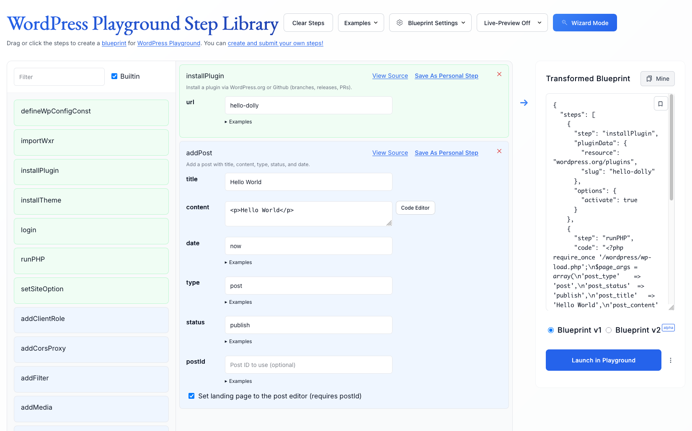
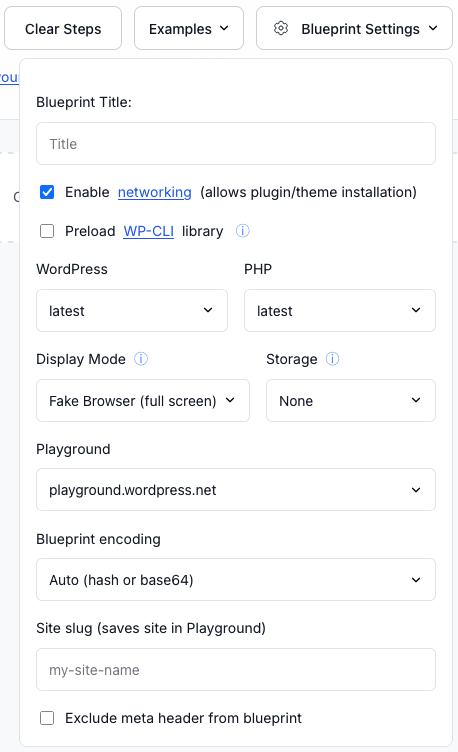
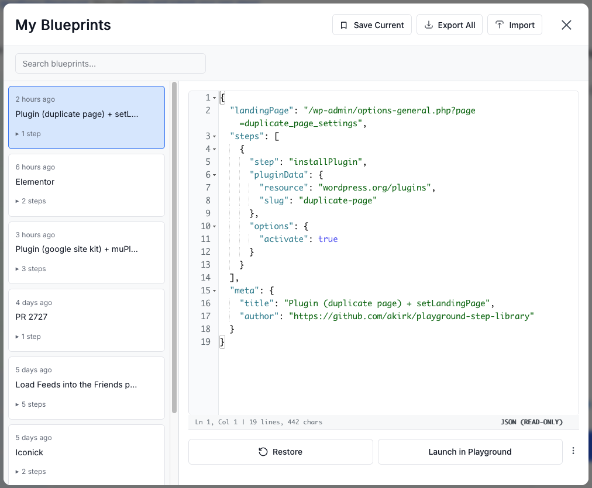
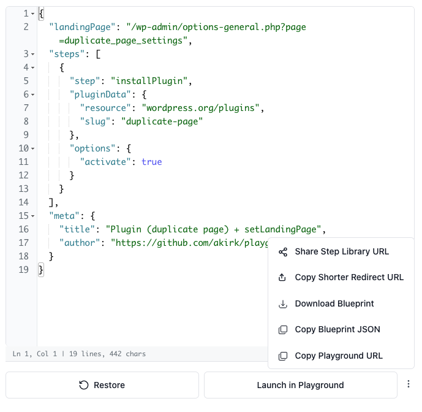
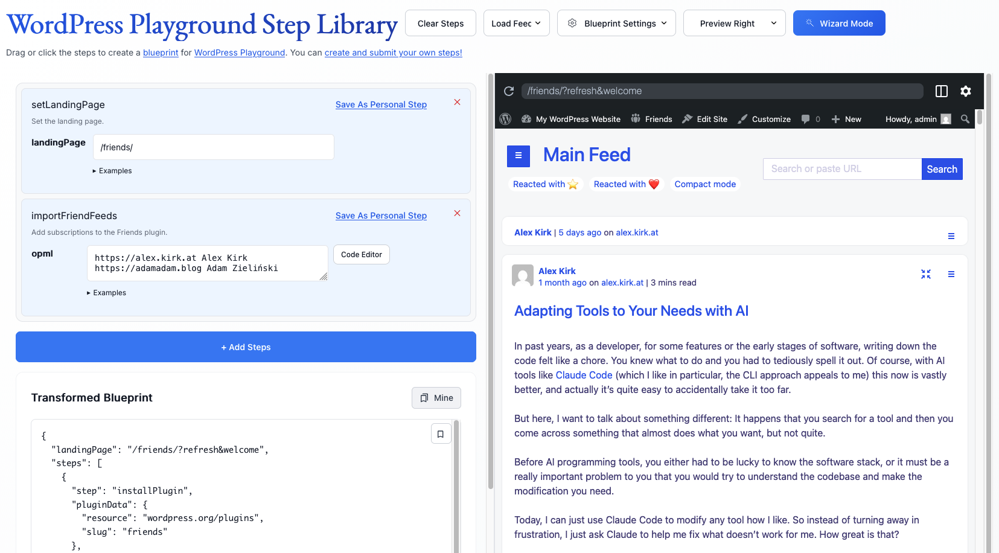

# UI Components Guide

Complete guide to all user interface components in the WordPress Playground Step Library.

## Quick Navigation

### 🎯 Main Components
- [**Overview**](#overview) - Interface layout and components
- [**Blueprint Settings**](#blueprint-settings) - Configure WordPress/PHP versions, display mode, storage
- [**My Blueprints**](#my-blueprints) - Save, search, and manage your blueprints
- [**Copy/Share Dropdown Menu**](#copyshare-dropdown-menu) - 5 ways to export and share

### 🎨 Display Modes
- [**Preview Mode**](#preview-mode) - Live WordPress preview alongside builder
- [**Wizard Mode**](#wizard-mode) - Simplified step-by-step interface
- [**Mobile Layout**](#mobile-layout) - Responsive design for phones/tablets

### ♿ Accessibility
- [**Accessibility**](#accessibility) - Keyboard navigation and screen reader support

### 🎨 Customization
- [**Customization**](#customization) - URL parameters and localStorage settings

### 💡 Tips & Troubleshooting
- [**Tips for Each Component**](#tips-for-each-component) - Best practices
- [**Troubleshooting**](#troubleshooting) - Common issues and solutions
- [**Best Practices**](#best-practices) - Workflow recommendations

---

## Overview


*The Step Library interface showing the step library (left), blueprint builder (center), and transformed blueprint output (right)*

The Step Library interface consists of:

1. **Blueprint Builder** - Main workspace for creating blueprints
2. **Blueprint Settings** - Configuration options
3. **My Blueprints** - Save and manage blueprints
4. **Copy/Share Menu** - Export and share options
5. **Preview Mode** - Live Playground preview
6. **Wizard Mode** - Simplified interface

## Blueprint Settings

**Location:** Header → Gear icon button ("Blueprint Settings")


*The Blueprint Settings panel with all configuration options visible*

The Blueprint Settings panel controls how your blueprint behaves in WordPress Playground.

### Configuration Options

#### Blueprint Title
**Field:** Text input  
**Purpose:** Give your blueprint a memorable name  
**Shows in:** Browser tab, saved blueprints list  
**Example:** "WooCommerce Demo Store"

#### Networking
**Field:** Checkbox (enabled by default)  
**Purpose:** Allows plugin/theme installation from WordPress.org and GitHub  
**Required for:** Any steps that install plugins or themes  
**Note:** Most blueprints need this enabled  

**When to disable:** Only if you're building a completely offline blueprint with pre-bundled code.

#### Preload WP-CLI
**Field:** Checkbox  
**Purpose:** Makes WP-CLI available via JS API or browser console  
**When to use:**
- Manual WP-CLI commands via console
- Custom JS code that uses WP-CLI
- **Not needed** if your blueprint includes `runWpCliCommand` steps (they auto-install it)

#### WordPress Version
**Field:** Dropdown  
**Options:** 
- `latest` (default) - Most recent stable
- `6.4`, `6.5`, `6.6`, `6.7` - Specific versions
- `beta` - Latest beta release
- `nightly` - Bleeding edge (daily builds)

**Use cases:**
- Testing compatibility with specific versions
- Demonstrating version-specific features
- Reproducing version-specific bugs

#### PHP Version
**Field:** Dropdown  
**Options:** `latest`, `7.4`, `8.0`, `8.1`, `8.2`, `8.3`

**Use cases:**
- Testing PHP compatibility
- Matching production environment
- Testing new PHP features

#### Display Mode
**Field:** Dropdown

| Mode | Description | Use Case |
|------|-------------|----------|
| **Fake Browser (full screen)** | Browser UI, fills viewport | Demos, presentations |
| **Fake Browser** | Browser UI, normal size | Documentation, tutorials |
| **Seamless** | No browser chrome, just WordPress | Embedded in other sites |

**Browser mode features:**
- Address bar (non-functional)
- Back/forward buttons
- Reload button
- Visual frame around WordPress

**Seamless mode:**
- Clean, no wrapper
- Great for iframes
- Feels like native WordPress

#### Storage
**Field:** Dropdown

| Option | Behavior | Use Case |
|--------|----------|----------|
| **None** | Changes lost on refresh | Demos, testing |
| **Browser** | Saved in browser storage | Personal experimentation |
| **Device** | Persistent via OPFS | Long-term development |

**Important:** 
- **Browser storage:** Tied to specific browser
- **Device storage:** Persistent across browsers, uses Origin Private File System (OPFS)

#### Playground Instance
**Field:** Dropdown

| Option | Description |
|--------|-------------|
| `playground.wordpress.net` | Official public Playground (default) |
| `http://127.0.0.1:5400/website-server` | Local development server |

**Use local when:**
- Developing Playground itself
- Testing experimental Playground features
- Offline development

#### Blueprint Encoding
**Field:** Dropdown

| Option | Description |
|--------|-------------|
| **Auto** | Automatically chooses best encoding |
| **Hash** | URL hash fragment (#) |
| **Base64** | Encoded as base64 parameter |

**Auto mode logic:**
- Small blueprints → Hash
- Large blueprints → Base64

#### Site Slug
**Field:** Text input  
**Pattern:** Lowercase alphanumeric with hyphens  
**Example:** `my-demo-site`

**Purpose:** Create a **persistent site** in WordPress Playground that can be accessed anytime at:
```
https://playground.wordpress.net/#{my-site-slug}
```

**Benefits:**
- Shareable permanent URLs
- Site persists across sessions
- Perfect for demos that need to stay live

#### Exclude Meta
**Field:** Checkbox  
**Purpose:** Remove metadata from blueprint JSON output

**Excludes:**
- Blueprint title
- WordPress/PHP version (if default)
- Display mode (if default)
- Other meta fields

**Use when:**
- Creating clean examples for documentation
- Minimizing blueprint size
- Focusing on steps only

## My Blueprints

**Location:** Header → Bookmark icon ("Mine")


*The My Blueprints modal showing saved blueprints list with search and action buttons*

A local storage system for saving and managing your blueprints.

### Features

#### Save Current Blueprint
**Button:** Bookmark icon with "Save Current"  
**Keyboard:** Click bookmark icon in blueprint output area

**Process:**
1. Click "Save Current" or bookmark icon
2. Enter a name (or auto-generates one)
3. Saved to browser localStorage
4. Appears in list

**Auto-naming:**
- Uses blueprint title if set
- Falls back to "Blueprint {timestamp}"
- Can rename anytime

#### Search Blueprints
**Field:** Search box at top of modal  
**Searches:**
- Blueprint names
- Step names (limited)

**Pro tip:** Use descriptive names for better searchability!

#### Blueprint List (Left Panel)

**Shows:**
- Blueprint name
- Last modified date
- Quick hover preview

**Click behavior:**
- Selects blueprint
- Shows details in right panel

**Mobile:**
- Tapping shows details
- Back button returns to list

#### Blueprint Details (Right Panel)


*Blueprint detail view with JSON preview and action buttons*

**Displays:**
- Full blueprint JSON (read-only)
- Syntax highlighting
- Scrollable viewer

**Actions available:**

##### Restore
**Icon:** Circular arrow  
**Effect:** Loads blueprint into main editor  
**Note:** Doesn't close modal - you can preview before closing

##### Launch in Playground
**Effect:** Opens blueprint in WordPress Playground in new tab

##### More Options Menu (Three Dots)

Same as main Copy Dropdown:
- Share Step Library URL
- Copy Shorter Redirect URL
- Download Blueprint
- Copy Blueprint JSON
- Copy Playground URL

##### Delete (Mobile)
**Mobile only:** Trash icon  
**Desktop:** Hover over list item for delete button

**Process:**
1. Click delete
2. Shows undo toast (3 seconds)
3. Can undo before toast closes
4. Permanently deleted after toast expires

### Import/Export

#### Export All Blueprints
**Button:** Download icon  
**Creates:** JSON file with all saved blueprints  
**Filename:** `step-library-blueprints-{timestamp}.json`

**Format:**
```json
{
  "blueprints": [
    {
      "id": "uuid",
      "title": "My Blueprint",
      "blueprint": { "steps": [...] },
      "timestamp": 1234567890
    }
  ]
}
```

#### Import Blueprints
**Button:** Upload icon  
**Accepts:** JSON files from Export All

**Behavior:**
- Merges with existing blueprints
- Skips duplicates (by ID)
- Shows count of imported blueprints

### Data Management

**Storage:** Browser localStorage  
**Key:** `playground-step-library-history`

**Clearing data:**
- Browser dev tools → Application → Local Storage
- Or browser's clear site data

**Limits:**
- Browser localStorage limit (~5-10 MB)
- Roughly 50-100 blueprints depending on size

## Copy/Share Dropdown Menu

**Location:** Below "Launch in Playground" button → Three dots icon


Provides multiple ways to export and share your blueprint.

### Menu Options

#### Share Step Library URL
**Icon:** Share nodes  
**Copies:** URL to Step Library with your blueprint pre-loaded

**Format:**
```
https://akirk.github.io/playground-step-library/#{base64_blueprint}
```

**Use when:**
- Sharing with collaborators for editing
- Allowing others to remix your blueprint
- Providing editable examples
- Teaching/learning

**Benefits:**
- Recipients can modify and customize
- Shows the step-by-step construction
- Educational

#### Copy Shorter Redirect URL
**Icon:** Upload arrow  
**Copies:** Compact URL that redirects to Playground

**What it is:**
A **shorter URL** optimized for sharing on platforms with character limits.

**Format:**
```
https://playground.wordpress.net/#<?php=base64url({compressed_json})
```

**Use when:**
- Sharing on social media (Twitter, Mastodon)
- Character limits matter
- Just want to share the running site
- Don't need editing capability

**Technical:**
- Uses PHP short tag trick
- More compact than full blueprint URL
- Redirects to full Playground URL

#### Download Blueprint
**Icon:** Download arrow  
**Creates:** `.json` file with your blueprint

**Filename:** `blueprint.json` (or custom if title is set)

**Use when:**
- Storing in version control (git)
- Sharing via email or file transfer
- Creating backup copies
- Documenting in repos

**Format:** Standard Blueprint JSON:
```json
{
  "steps": [
    { "step": "...", ... }
  ]
}
```

#### Copy Blueprint JSON
**Icon:** Copy documents  
**Copies:** Raw blueprint JSON to clipboard

**Use when:**
- Pasting into documentation
- Sharing in code blocks
- Programmatic use
- Quick inspection

**Format:** Same as Download, but copied to clipboard

#### Copy Playground URL
**Icon:** Copy documents  
**Copies:** Direct link to running WordPress Playground

**Format:**
```
https://playground.wordpress.net/#{"steps":[...]}
```

**Use when:**
- Just want to share the running site
- Don't need Step Library interface
- Direct access to WordPress
- Embedding in iframes

### Comparison Table

| Option | Editable | Short | Use Case |
|--------|----------|-------|----------|
| Share Step Library URL | ✅ Yes | ❌ No | Collaboration, teaching |
| Shorter Redirect URL | ❌ No | ✅ Yes | Social media, quick shares |
| Download Blueprint | ✅ Yes* | N/A | Git, backups, documentation |
| Copy Blueprint JSON | ✅ Yes* | N/A | Code examples, programmatic |
| Copy Playground URL | ❌ No | ❌ No | Direct site access |

*Editable if loaded back into Step Library or used programmatically

## Preview Mode

**Location:** Header → "Live-Preview Off" dropdown


*Preview mode showing live WordPress Playground alongside the blueprint builder*

Adds a live WordPress Playground preview alongside your builder.

### Options

#### Live-Preview Off
**Default:** No preview shown  
**Viewport:** Full width for blueprint builder

#### Preview Bottom
**Layout:** Horizontal split  
**Builder:** Top half  
**Preview:** Bottom half

**Best for:**
- Wider screens
- Horizontal workflows
- Traditional desktop layouts

#### Preview Right
**Layout:** Vertical split  
**Builder:** Left side  
**Preview:** Right side

**Best for:**
- Ultra-wide monitors
- Side-by-side comparison
- Modern widescreen layouts

### Preview Features

**Auto-update:**
- Changes reflect automatically
- Debounced (waits for you to stop typing)
- No manual refresh needed

**Interactive:**
- Fully functional WordPress
- Can click, navigate, test
- Changes persist during session

**Performance:**
- Runs in iframe
- Separate Playground instance
- Doesn't slow down builder

### Tips

1. **Use for testing:** Verify steps work before sharing
2. **Iterate quickly:** Make changes, see results instantly
3. **Debug issues:** See errors in preview console
4. **Responsive design:** Resize preview to test layouts

## Wizard Mode

**Location:** Header → Wand icon ("Wizard Mode")

Simplified, guided interface for building blueprints.

### Features

- **Step-by-step:** One step at a time
- **Guided:** Prompts for each field
- **Simplified:** Fewer options visible
- **Beginner-friendly:** Less overwhelming

### When to Use

**Wizard Mode:**
- New to blueprints
- Simple, linear workflows
- Teaching others
- Quick prototypes

**Standard Mode:**
- Complex blueprints
- Need to reorder steps
- Multiple step types
- Advanced customization

## Mobile Layout

### Responsive Behavior

**Narrow screens (≤ 734px):**
- Step library hidden by default
- "+ Add Steps" button shows library
- Single column layout
- Optimized touch targets

**Wide screens (> 734px):**
- Side-by-side layout
- Always-visible step library
- Drag-and-drop enabled
- Desktop optimizations

### Mobile Features

**My Blueprints:**
- Single column mode
- Swipe/tap navigation
- Full-screen detail view
- Back button to list

**Steps:**
- Tap to add (no drag)
- Larger touch targets
- Expanded by default
- Mobile-optimized forms

## Accessibility

### Keyboard Navigation

- **Tab:** Navigate between fields
- **Enter:** Submit forms, select options
- **Escape:** Close modals
- **Space:** Toggle checkboxes

### Screen Readers

- Semantic HTML structure
- ARIA labels on icons
- Descriptive button text
- Form field associations

### Visual

- High contrast options
- Icon + text labels
- Clear focus indicators
- Readable font sizes

## Customization

### URL Parameters

You can customize the initial state via URL:

```
https://akirk.github.io/playground-step-library/?mode=wizard
```

Supported params:
- `mode=wizard` - Start in wizard mode
- `example=basic` - Load an example

### localStorage Settings

**Key:** `playground-step-library-settings`

**Stored:**
- Last used WordPress/PHP versions
- Display mode preference
- Preview mode preference
- Wizard mode state

## Tips for Each Component

### Blueprint Settings
- Set once, forget about it
- Save as default for new blueprints
- Test with different versions
- Use seamless mode for embeds

### My Blueprints
- Save frequently as checkpoints
- Export weekly as backup
- Use descriptive names
- Delete old experiments

### Copy Menu
- Know your audience (edit vs view)
- Use shorter URLs for social
- Download for version control
- Copy JSON for docs

### Preview Mode
- Enable while building
- Disable for performance
- Use bottom on laptops
- Use right on widescreen

## Troubleshooting

### Settings Not Saving
- Check localStorage is enabled
- Check browser privacy settings
- Try different browser
- Clear cache and retry

### Preview Not Loading
- Check networking is enabled
- Verify blueprint is valid
- Check browser console for errors
- Try reloading page

### My Blueprints Empty
- Check localStorage
- Try exporting/importing
- Verify not in incognito mode
- Check storage quota

### Copy Menu Not Working
- Check clipboard permissions
- Try manual copy (Ctrl+C)
- Update browser
- Check browser security settings

## Best Practices

### Workflow Recommendations

1. **Start with settings** - Configure before building
2. **Enable preview** - Test as you go
3. **Save checkpoints** - Use My Blueprints frequently
4. **Export regularly** - Backup to files
5. **Share appropriately** - Choose right format for audience

### Organization Tips

1. **Name everything** - Titles, blueprints, steps
2. **Use folders** - Prefix names with categories
3. **Version your work** - Save iterations
4. **Document intent** - Add blueprint titles
5. **Clean up regularly** - Delete old experiments

## Related Documentation

- [Tips & Tricks](tips.md) - Power user features
- [Architecture](architecture.md) - How it works
- [Steps Reference](steps-reference.md) - All available steps
